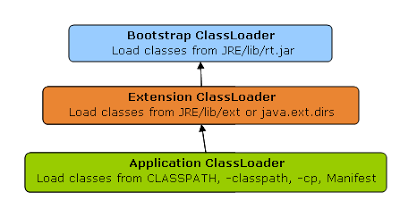

### Class Loaders in Java:

Class loaders are responsible for loading Java classes during runtime dynamically to the JVM (Java Virtual Machine). Also, they are part of the JRE (Java Runtime Environment). Hence, the JVM doesn't need to know about the underlying files or file systems in order to run Java programs thanks to class loaders.

Also, these Java classes aren't loaded into memory all at once, but when required by an application. This is where class loaders come into the picture. They are responsible for loading classes into memory.

### Types of Class Loaders:

1. **Bootstrap Class Loader:** 
	Java classes are loaded by an instance of java.lang.ClassLoader. However, class loaders are classes themselves. Hence, the question is, who loads the java.lang.ClassLoader itself?

	This is where the bootstrap or primordial class loader comes into the picture.

	It's mainly responsible for loading JDK internal classes, typically rt.jar and other core libraries located in $JAVA_HOME/jre/lib directory. Additionally, Bootstrap class loader serves as a parent of all the other ClassLoader instances.

	This bootstrap class loader is part of the core JVM and is written in native code as pointed out in the above example. Different platforms might have different implementations of this particular class loader.
	
	

2. **Extension Class Loader:** 
	The extension class loader is a child of the bootstrap class loader and takes care of loading the extensions of the standard core Java classes so that it's available to all applications running on the platform.

	Extension class loader loads from the JDK extensions directory, usually $JAVA_HOME/lib/ext directory or any other directory mentioned in the java.ext.dirs system property.It is implemented by the sun.misc.Launcher$ExtClassLoader class.

3. **System Class Loader:**
	An Application ClassLoader is also known as a System ClassLoader. It loads the Application type classes found in the environment variable CLASSPATH, -classpath or -cp command line option. The Application ClassLoader is a child class of Extension ClassLoader..This is implemented by the sun.misc.Launcher$AppClassLoader class.
	
	Java Platform, Enterprise Edition (Java EE) application servers typically load classes from a deployed WAR or EAR archive by a tree of classloaders, isolating the application from other applications, but sharing classes between deployed modules. So-called "servlet containers" are typically implemented in terms of multiple classloaders.
		
**Note:** The ClassLoader Delegation Hierarchy Model always functions in the order Application ClassLoader->Extension ClassLoader->Bootstrap ClassLoader. The Bootstrap ClassLoader is always given the higher priority, next is Extension ClassLoader and then Application ClassLoader.
	
**Principles of functionality of a Java ClassLoader:**

1. **Delegation Model:** The Java Virtual Machine and the Java ClassLoader use an algorithm called the Delegation Hierarchy Algorithm to Load the classes into the Java file.
The ClassLoader works based on a set of operations given by the delegation model. They are:
		
	
	
	- ClassLoader always follows the Delegation Hierarchy Principle.
	- Whenever JVM comes across a class, it checks whether that class is already loaded or not.
	- If the Class is already loaded in the method area then the JVM proceeds with execution.
	- If the class is not present in the method area then the JVM asks the Java ClassLoader Sub-System to load that particular class, then ClassLoader sub-system hands over the control to   		Application ClassLoader.
	- Application ClassLoader then delegates the request to Extension ClassLoader and the Extension ClassLoader in turn delegates the request to Bootstrap ClassLoader.
	- Bootstrap ClassLoader will search in the Bootstrap classpath(JDK/JRE/LIB). If the class is available then it is loaded, if not the request is delegated to Extension ClassLoader.
	- Extension ClassLoader searches for the class in the Extension Classpath(JDK/JRE/LIB/EXT). If the class is available then it is loaded, if not the request is delegated to the Application ClassLoader.
	- Application ClassLoader searches for the class in the Application Classpath. If the class is available then it is loaded, if not then a ClassNotFoundException exception is generated.

2. **Visibility Principle:** The Visibility Principle states that a class loaded by a parent ClassLoader is visible to the child ClassLoaders but a class loaded by a child ClassLoader is not visible to the parent ClassLoaders. Suppose a class GEEKS.class has been loaded by the Extension ClassLoader, then that class is only visible to the Extension ClassLoader and Application ClassLoader but not to the Bootstrap ClassLoader. If that class is again tried to load using Bootstrap ClassLoader it gives an exception java.lang.ClassNotFoundException.

3. **Uniqueness Property:** The Uniquesness Property ensures that the classes are unique and there is no repetition of classes. This also ensures that the classes loaded by parent classloaders are not loaded by the child classloaders. If the parent class loader isn’t able to find the class, only then the current instance would attempt to do so itself.

**How to load class explicitly in Java?**

Java provides API to explicitly load a class by `Class.forName(classname)` and `Class.forName(classname, initialized, classloader)`, 
remember JDBC code which is used to load JDBC drives we have seen in Java program to Connect Oracle database. 
As shown in above example you can pass name of ClassLoader which should be used to load that particular class along with binary name of class. 
Class is loaded by calling **loadClass()** method of **java.lang.ClassLoader** class which calls findClass() method to locate bytecodes for corresponding class. 
Extension ClassLoader uses **java.net.URLClassLoader** which search for class files and resources in JAR and directories. 


**How to get ClassLoader name?**

```Java
public class ClassLoaderTest {

	public static void main(String[] args) {

		System.out.println("class loader for HashMap: "+ java.util.HashMap.class.getClassLoader());
		System.out.println("class loader for DNSNameService: "+ sun.net.spi.nameservice.dns.DNSNameService.class.getClassLoader());
		System.out.println("class loader for this class: "+ ClassLoaderTest.class.getClassLoader());
		System.out.println(com.mysql.jdbc.Blob.class.getClassLoader());

	}

}
```

**Output:**

```
class loader for HashMap: null
class loader for DNSNameService: sun.misc.Launcher$ExtClassLoader@7c354093
class loader for this class: sun.misc.Launcher$AppClassLoader@64cbbe37
sun.misc.Launcher$AppClassLoader@64cbbe37
```