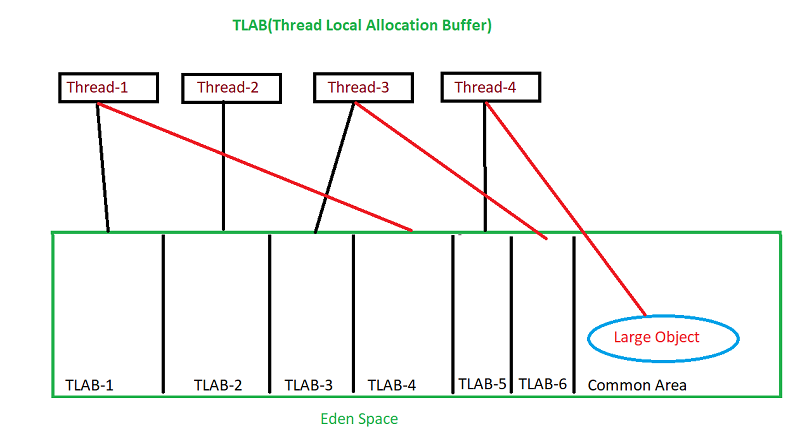

**TLAB(Thread Local Allocation Buffer):**

**What is TLAB?**

In Java, new objects are allocated in Eden. It’s a memory space shared between threads. If you take into account that multiple threads can allocate new objects at the same time, it becomes obvious that some sort of synchronization mechanism is needed. How could it be solved?
Here is where TLAB comes into play. TLAB stands for Thread Local Allocation Buffer and it is a region inside Eden, which is exclusively assigned to a thread. In other words, only a single thread can allocate new objects in this area. Each thread has it's own TLAB, as long as objects are allocated in TLABs, there is no need for any type of synchronization. Allocation inside TLAB is a simple pointer bump (that’s why it’s sometimes called pointer bump allocation)

**What if TLAB gets Full?**

As you can imagine, TLAB is not infinite, and at some point, it starts getting full. If a thread needs to allocate a new object that does not fit into the current TLAB (because it’s almost full), two things can happen:

	1. The thread gets a new TLAB
	2. The object is allocated outside TLAB
The JVM decides what will happen based on several parameters. If the first option is chosen, the thread’s current TLAB becomes “retired,” and the allocation is done in a new TLAB. In the second scenario, the allocation is done in a shared region of Eden, and that’s why some sort of synchronization is needed. As usually, synchronization comes at the price.

**Too Large Objects:**

By default, TLABs are dynamically resized for each thread individually. Size of TLAB is recalculated based on the size of Eden, the number of threads, and their allocation rates. Changing them might impact the TLABs sizing – however, because an allocation rate usually varies, there is no easy formula for that. When a thread needs to allocate a large object (e.g. large array), which would never fit into the TLAB, then it will be allocated in a shared region of Eden, which, again, means synchronization.

Having some objects allocated outside TLAB isn’t necessarily a bad thing – this is a typical situation that happens before minor GC. The problem is when there is a huge number of allocations outside TLAB as compared to the ones inside TLAB. If that’s the case, there are two options available:

1. *Make the objects smaller:* Fixing the code is the best choice
2. *Try to adjust TLAB sizing:* Adjusting TLAB size manually is not the best option

**For Example:**
Think of thread 1 claiming a TLABfrom offset 0 to 99 and thread 2 claiming one from offsets 100 to 199. The contract says that once claimed, thread 2 cannot allocate in 0-99 and thread 1 cannot allocate in 100-199. No thread can claim this space as its future allocation buffer either. This way, each thread can allocate 100 objects without synchronizing if each object takes one of the hypothetical slots. Allocating outside a TLAB is not very expensive but it is obviously more expensive than within a TLAB as it requires communication with other threads which might run concurrenctly.

**Summary:**

The idea of a TLAB is to reduce the need of synchronization between threads.
Every thread has it's own TLAB. 
Since each thread can only write to its own TLAB, then there is no need for synchronization.
Assuming that a TLAB can hold 100 objects, a thread would only need to aquire a lock for claiming more memory when allocating the 101 object. 
Without TLABs, each thread should aquire a lock for every object creation.

**TLAB flags in JVM:**  Listing only few flags

 1. `-XX:+PrintTLAB:` JVM would log the TLAB usage during each Minor GC. First, it prints TLAB usage for each thread in a separate line.After those per-thread statistics, JVM prints a line of summary data.
 2. `-XX:TLABSize`(Defaults to zero) you can set positive number.
 3. `-XX:ResizeTLAB`  is enabled (Which is by default), then JVM can adaptively  resize the TLAB size. The new size is always depends on three major factors:
	- Number of application threads
	- Allocation rate
	- Eden Size

 

 

Tenured
 
permgen